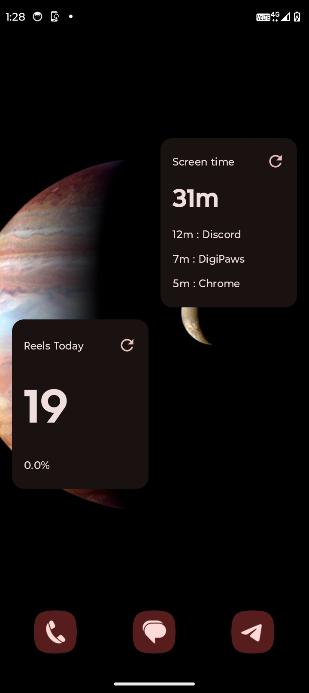
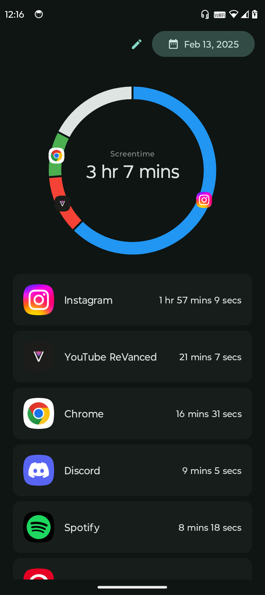
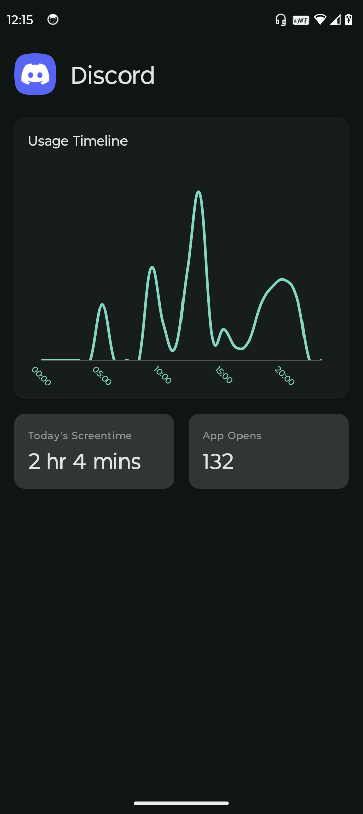

[![Latest release][release-badge]](https://github.com/felle-dev/screentime-app/releases)
[![Android][android-badge]](https://developer.android.com)
[![License][license-badge]](LICENSE)

[**ScreenTime**](https://github.com/felle-dev/screentime-app) is a simple and intuitive screen time management app that helps you reduce digital distractions and build healthier habits.

Track your app usage, block distracting apps, and take control of your screen time. Whether you're studying, working, or just trying to cut down on mindless scrolling, ScreenTime keeps you focused and productive.

[](https://github.com/felle-dev/screentime-app/releases)


## Features

- **App Blocking** – Block distracting apps to stay focused.
- **Usage Tracking** – Monitor how much time you spend on each app.
- **Customizable UI** – Simple and intuitive interface built with Android XML.
- **Versatile Blockers** – Block apps, keywords, and unwanted in-app screens (e.g., YouTube shorts, comments).
- **Privacy First** – Your data stays on your device.


## Screenshots

Click on any image to enlarge it.
<table>
	<tr>
		<td></td>
		<td></td>
		<td></td>
		<td></td>
		<td></td>
		<td></td>
		<td></td>
		<td></td>
	</tr>
</table>


## Tech Stack

- **Language:** Kotlin
- **UI:** Android XML
- **Minimum SDK:** API 24 (Android 7.0)
- **Target SDK:** API 36


## Getting Started

### Prerequisites

- [Android Studio](https://developer.android.com/studio) (latest stable version)
- Android device or emulator (API 24+)

### Installation

1. Clone the repository:
   ```bash
   git clone https://github.com/felle-dev/screentime-app.git
   cd ScreenTime
   ```

2. Open the project in Android Studio.

3. Build and run the app on your device or emulator.


## Contributing

Contributions are what make the open-source community such an amazing place to learn, inspire, and create. Any contributions you make are **greatly appreciated**.

1. Fork the Project
2. Create your Feature Branch (`git checkout -b feature/AmazingFeature`)
3. Commit your Changes (`git commit -m 'Add some AmazingFeature'`)
4. Push to the Branch (`git push origin feature/AmazingFeature`)
5. Open a Pull Request

Feel free to open issues for bug reports, feature requests, or questions!


## License

This project is licensed under the GNU General Public License v3.0 - see the [LICENSE](LICENSE) file for details.

[release-badge]: https://img.shields.io/github/v/release/felle-dev/screentime-app?style=for-the-badge
[android-badge]: https://img.shields.io/badge/Android-3DDC84?style=for-the-badge&logo=android&logoColor=white
[license-badge]: https://img.shields.io/github/license/felle-dev/screentime-app?style=for-the-badge